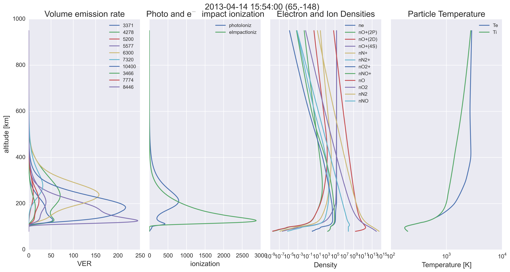
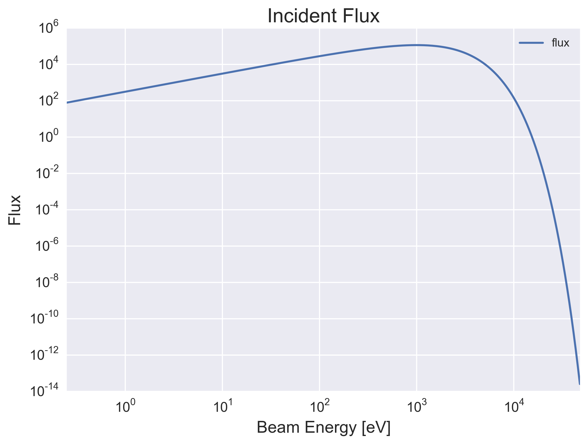

.. image:: https://codeclimate.com/github/scienceopen/glowaurora/badges/gpa.svg
   :target: https://codeclimate.com/github/scienceopen/glowaurora
   :alt: Code Climate

=============
glow-aurora
=============
`Stan Solomon's  GLOW Auroral model <http://download.hao.ucar.edu/pub/stans/glow/>`_ -- now in Python!

Caution
--------
It is currently (0.973) necessary to restart the Python kernel for each simulation run. This is due to the "save" statement in ssflux.f.
With the refactoring of the code underway to Fortran90, it is hoped this blanket save statement can be eliminated.

For safety's sake, run this program from the command line (Terminal) to ensure you get a fresh import (flushing all variables).

Installation
-------------
from Terminal::

  git clone --depth 1 https://github.com/scienceopen/glow-aurora
  conda install --file requirements.txt
  python setup.py install

Demo
----
from Terminal::

  python demo_aurora.py

will show modeled VER vs. altitude for the input parameter set.

Papers
------
(Thanks to Stephen Kaeppler to pointing these out)

http://download.hao.ucar.edu/pub/stans/papers/BaileyJGR2002.pdf

http://download.hao.ucar.edu/pub/stans/papers/SolomonJGR1988.pdf

Appendix (Not necessary for the typical user)
----------------------------------------------
Download the latest source code from Stan Solomon
~~~~~~~~~~~~~~~~~~~~~~~~~~~~~~~~~~~~~~~~~~~~~~~~~~
from Terminal::

  wget -r -np -nc -nH --cut-dirs=4 --random-wait --wait 1 -R "index.html*" http://download.hao.ucar.edu/pub/stans/glow/v0.973/

Download Stan's copy of IRI files
~~~~~~~~~~~~~~~~~~~~~~~~~~~~~~~~~~
from Terminal::

  wget -r -np -nc -nH --cut-dirs=3 --random-wait --wait 1 -R "index.html*" http://download.hao.ucar.edu/pub/stans/iri/

compile the Fortran code by itself
~~~~~~~~~~~~~~~~~~~~~~~~~~~~~~~~~~
from Terminal::

  make

Fortran self-test
~~~~~~~~~~~~~~~~~~
after compiling, from Terminal::

  ./auroraexample < aurexample.in > aurtest.out

observe that aurtest.out is almost exactly equal to aurexample.out, to the least digit of precision.

On Windows, consider `factors like <https://scivision.co/f2py-running-fortran-code-in-python-on-windows/>`_

Licensing
=========

original Fortran code in directory ``fortrancode/`` as obtained from http://download.hao.ucar.edu/pub/stans/glow/:

"This software is part of the GLOW model.  Use is governed by the Open Source Academic Research License 
Agreement contained in the file glowlicense.txt."

Python code and modifications to original Fortran code:  GPLv3+
